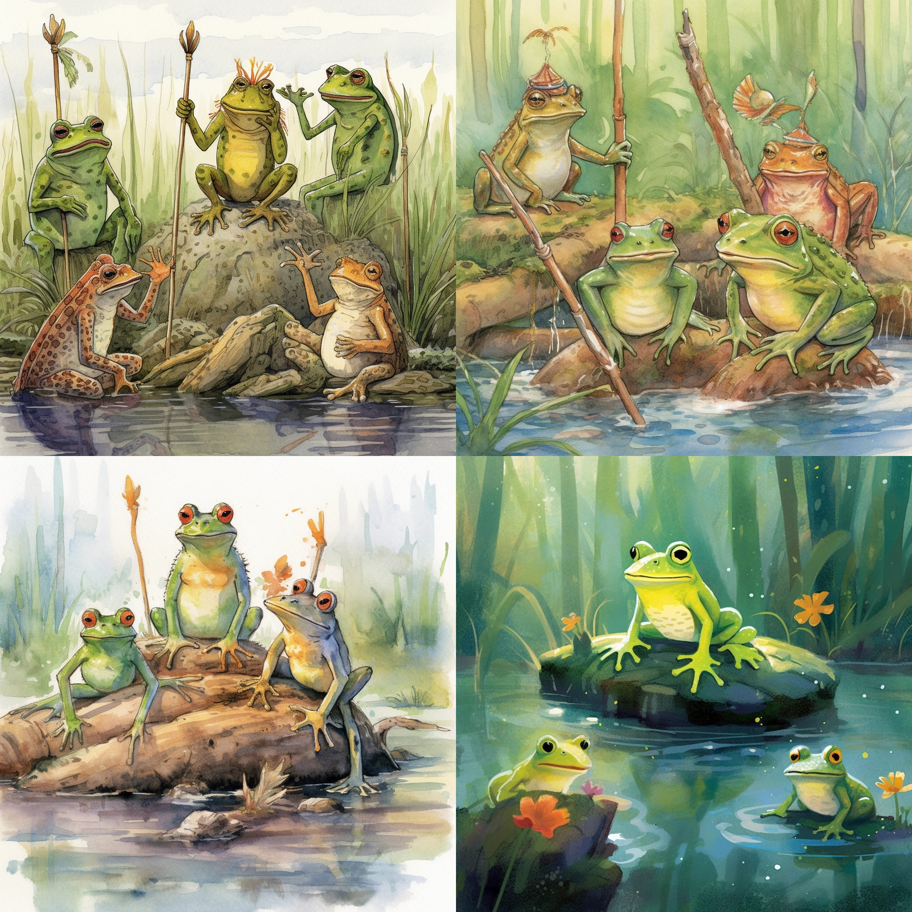

---
### Pinned artwork and metadata on Pinata

mercury_and_the_woodman.json
6/5/2023 2.68 KB
QmaWn4VNC6Xgv5n7d3q4m1Vyyk1nHqkN7T9HX9Wp9P7RKQ

mercury_and_the_woodman_1.png
6/5/2023 1.99 MB
QmeNJRLBVuCDNxwgfjLoJXsLCZhVrZ88tKaJKzyrgtEw4S

---
 
the_plane_tree.json
6/5/2023 783 B   
QmXiyCnrRcRCWyUCeripwA9nZtV4fm6yFqhoPNV3qPbQsQ

the plane tree_1.png
6/5/2023 2.20 MB   
QmWc8MxjZ1Pa5TrmuL24NaKgnCCDcGf4FjKFoKtrGBQeRa

---

the_travelers_and_the_sea.json
6/5/2023 895 B
QmaESthErSXtPz2uCs1bHq5tMR1vMgEew3wbWSb3mMoVFB

travelers_of_the_sea_1.png
6/5/2023 1.90 MB   
QmcKTNx6GvwY2J1M8vLZsApPQfqsjZYRqndBU8zaoDrASa

---

the_lion_and_the_mouse.json
6/1/2023 1.23 KB   
QmUrZF3bAyCSrjhNRvY6TcoDqk3mFyWrPhSy3xPyykD4w2

the_lion_and_the_mouse_1.png
6/1/2023 1.93 MB
QmdqfLpCCyEX483LHxCnwoED4cYhG5QD3dkmTNCAFsrfwV

---
## Title: The Lion and the Mouse
### Moral: A kindness is never wasted.

> "A Lion lay asleep in the forest, his great head resting on his paws.",
        "A timid little Mouse came upon him unexpectedly, and in her fright and haste to get away, ran across the Lion's nose.", "Roused from his nap, the Lion laid his huge paw angrily on the tiny creature to kill her.",
        "Spare me!, begged the poor Mouse, Please let me go and some day I will surely repay you.",
        "The Lion was much amused to think that a Mouse could ever help him.",
        "But he was generous and finally let the Mouse go.",
        "Some days later, while stalking his prey in the forest, the Lion was caught in the toils of a hunter's net.",
        "Unable to free himself, he filled the forest with his angry roaring.",
        "The Mouse knew the voice and quickly found the Lion struggling in the net.",
        "Running to one of the great ropes that bound him, she gnawed it until it parted, and soon the Lion was free.",
        "You laughed when I said I would repay you, said the Mouse.",
        "Now you see that even a Mouse can help a Lion."
        

---
 ## Title: The Plane Tress
 ### Moral: Our best blessings are often the least appreciated. 
 
 >  "Two Travellers, walking in the noonday sun, sought the shade of a widespreading tree to rest.",
        "As they lay looking up among the pleasant leaves, they saw that it was a Plane Tree.",
        "How useless is the Plane!, said one of them.",
        "It bears no fruit whatever, and only serves to litter the ground with leaves.",
        "Ungrateful creatures!", "said a voice from the Plane Tree.",
        "You lie here in my cooling shade, and yet you say I am useless!",
        "Thus ungratefully, O Jupiter, do men receive their blessings!"
        

---

## Title: The Frogs Who Wished for a King
### Moral: Be sure you can better your condition before you seek to change.

> "The Frogs were tired of governing themselves.",
        "They had so much freedom that it had spoiled them, and they did nothing but sit around croaking in a bored manner and wishing for a government that could entertain them with the pomp and display of royalty, and rule them in a way to make them know they were being ruled.",
        "No milk and water government for them, they declared.",
        "So they sent a petition to Jupiter asking for a king.",
        "Jupiter saw what simple and foolish creatures they were, but to keep them quiet and make them think they had a king he threw down a huge log, which fell into the water with a great splash.",
        "The Frogs hid themselves among the reeds and grasses, thinking the new king to be some fearful giant.",
        "But they soon discovered how tame and peaceable King Log was.",
        "In a short time the younger Frogs were using him for a diving platform, while the older Frogs made him a meeting place, where they complained loudly to Jupiter about the government.",
        "To teach the Frogs a lesson the ruler of the gods now sent a Crane to be king of Frogland.",
        "The Crane proved to be a very different sort of king from old King Log.",
        "He gobbled up the poor Frogs right and left and they soon saw what fools they had been.",
        "In mournful croaks they begged Jupiter to take away the cruel tyrant before they should all be destroyed.",
        "How now!, cried Jupiter Are you not yet content?",
        "You have what you asked for and so you have only yourselves to blame for your misfortunes."

      