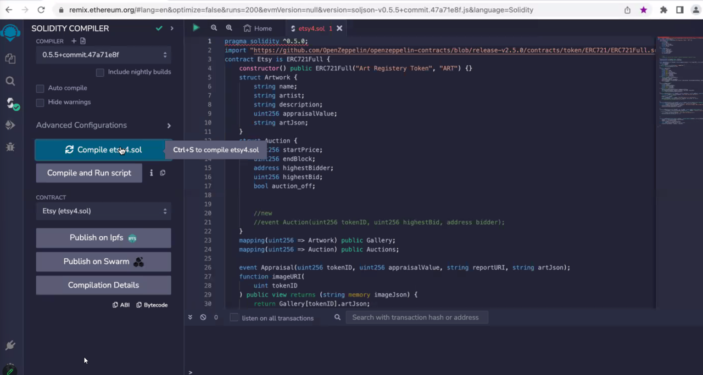

# Project 3: CryptoFables: NFTs and Blockchain Transforming Artistic Narratives

#### Submitted by: Ramgopal Gollakota, Taylor Little, Celeste Terrell, and Timothy Prost

## Executive summary

#### Fintech Relevance

We are harnessing the power of blockchain, an emerging and dominant force in fintech, to transform the art industry. By leveraging the inherent qualities of trust and transparency offered by blockchain technology, we are revolutionizing the way art is bought and sold. Within our platform, every transaction is conducted with utmost trust and transparency, providing a secure and reliable environment for artists, collectors, and enthusiasts alike. Through this innovative approach, we are redefining the art industry and opening up new possibilities for artists and art lovers.

#### Technological Aspects

We've crafted "Etsy4", a savvy decentralized application (DApp) built on the Ethereum blockchain. Utilizing smart contracts, we have created a seamless platform for trading non-fungible token (NFT) artwork. Through "Etsy4", artists can showcase their unique creations as NFTs, granting them unparalleled digital ownership and provable authenticity. Collectors and art enthusiasts can explore a vast collection of NFT artwork, securely purchase pieces, and build their own digital art portfolios.

To enhance the user experience, our project integrates front-end tools such as Streamlit, providing an intuitive and interactive interface for users to navigate through the platform effortlessly. With the integration of Web3 tools, users can seamlessly connect their Ethereum wallets, making transactions and interactions with the DApp smooth and secure. The combination of these technologies empowers users to engage with the art market in an entirely new way, bringing together artists and collectors in a decentralized and transparent ecosystem.

By leveraging the power of blockchain, smart contracts, and user-friendly tools, we are reshaping the art industry and unlocking new possibilities for artists and art enthusiasts. "Etsy4" not only revolutionizes the way art is bought and sold but also fosters a community of artists and collectors who appreciate the value of digital ownership and decentralized platforms. Through our innovative DApp, we aim to democratize art and empower artists to reach a global audience, while providing collectors with an unprecedented level of trust and authenticity in their art acquisitions.

#### Value

We're building an efficient marketplace that eradicates forgeries and guarantees secure value transfer. Through our platform, artists can harness the power of generative AI techniques to create one-of-a-kind artworks inspired by fables and other themes. This fusion of art and technology breathes new life into timeless narratives, offering a fresh perspective to both creators and collectors.

By leveraging AI for NFT generation, we showcase the convergence of technology fields, driving innovation and creating unique value. Our marketplace enables artists to explore the creative possibilities of AI while providing a trusted platform for art enthusiasts to discover and acquire these captivating digital creations. This integration of cutting-edge technologies revolutionizes the art industry, bridging the gap between art and technology and opening up exciting avenues for artistic expression and appreciation.

### Code overview and design

We have incorporated features from Open Zeppelin's ERC721Full standard, which serves as the foundation of our platform. This integration empowers users to seamlessly register their artwork, set an appraisal value, mint unique tokens, initiate auctions, conclude auctions, and transfer tokens and funds to the highest bidder.

Our user flow begins with artists registering their artwork on our platform, providing essential details such as the artwork's name, description, and artist information. They can also set an appraisal value, reflecting the estimated worth of the artwork. Once registered, the artwork is assigned a unique token, representing its ownership on the blockchain.

Artists have the ability to mint tokens, creating a limited supply of unique digital assets tied to their artwork. This process ensures the scarcity and exclusivity of each token, adding value to the artwork and enhancing its collectability.

##### User Flows

##### ETSI4 Contract Details

### Front end and AI generated NFTs

####

#### Streamlit

We have implemented Streamlit, an interactive web application framework, to seamlessly interact with the Ethereum blockchain and provide real-time NFT information to users. Through Streamlit, we enable a dynamic user interface that enhances the overall experience.

The integration with the Ethereum blockchain is facilitated by the web3.py library, which allows us to interact with smart contracts deployed on the Ethereum network. By leveraging web3.py, we establish a connection to the blockchain, enabling seamless communication with our smart contract.

To facilitate contract interaction, we load the ABI (Application Binary Interface) from a JSON file, which provides a standardized way to communicate with the smart contract functions. With the contract instance established, we can invoke functions such as registering artwork, setting appraisal values, minting tokens, starting and ending auctions, and transferring tokens and funds to the highest bidder. This seamless contract interaction ensures a secure and efficient marketplace for our users.

#### AI generated NFTs

n our project, we incorporate fables, which are classic descriptive narratives, to set the theme for the AI-generated artwork. These fables serve as inspiration for the artwork creation process. Leveraging AI models, specifically OpenAI GPT-4, we generate detailed artwork from the text-based fable. This fusion of art and technology allows us to create unique digital assets in the form of NFTs.

To accomplish this, we leverage the power of the OpenAI API itself. The AI model interprets the fable and generates a description for a unique piece of artwork. This description then becomes an integral part of the NFT, providing additional context and meaning to the artwork.

To ensure the immutability and availability of the AI-generated artwork, we utilize Pinata's IPFS (InterPlanetary File System) service. We pin the artwork to the IPFS network, receiving an IPFS hash that serves as a unique identifier for the artwork. This step guarantees that the artwork remains accessible and securely stored.

Furthermore, we tokenize the artwork by minting an NFT on the Ethereum blockchain. We utilize the IPFS hash obtained from Pinata to associate the artwork with the NFT. The details of the artwork and its association with the NFT are stored in JSON format, providing a comprehensive record of the artwork's provenance and ownership. Additional details are in Appendix B.

### Technical components of our Prototype

##### Blockchain related

1.Ethereum Blockchain: Smart contract platform

2.Etsy4 Smart Contract: Art registration & transactions

3.Solidity Code: Contract language

4.OpenZeppelin Libraries: ERC721 token implementation

5.IPFS: Decentralized storage

6.Pinata: IPFS pinning service

7.MetaMask: Blockchain browser interaction

8.Alternatively use Remix Shanghai devNet addresses

9.Remix: Smart contract IDE

10.Ganache: Local blockchain simulator

11.Web3: Ethereum interaction library

##### Front-end Related

1.Streamlit: Python-based interface

2.Generative AI API: Unique art creation

### Development and Testing steps

1.Smart Contract Development: Utilized 'ArtRegistry' Solidity contract as the foundation, modifying for our use-case and added functionality to perform ‘Auction’.

2.Contract Deployment: Deployed the smart contract to a local Ethereum blockchain via Ganache.

3.Remix for Testing: Used Remix IDE for initial testing and debugging of the contract.

4.Metamask Setup: Configured Metamask to interact with the local blockchain.

5.Registration: Registered artwork by associating it with a Metamask address.

6.Value Assignment: Assigned a value to the artwork during the tokenization process.

7.Token Minting: Minted a unique NFT for each artwork, stored necessary information (metadata) on IPFS.

8.Appraisal Value Assignment: Assigned an appraisal value to the artwork to start the auction.

9.Auction Process: Enabled bidders to bid for the artwork using the smart contract.

10.Finalization: Auction concluded either when the owner accepted the bid or when the auction time ran out.

### Demo and Screenshots

Appendix A has the screenshots and the video of the demo.

## Summary

### RESULTS AND CONCLUSION

We have achieved the successful development and deployment of a decentralized application (Dapp) on the Ethereum blockchain, specifically designed for conducting NFT auctions. This accomplishment showcases our proficiency in a wide range of technical skills, including Solidity smart contract development, Remix for contract deployment, Web3.py for blockchain interaction, ERC721 tokenization for NFT creation, and the implementation of generative AI for image and story generation.

Our project exemplifies the immense potential of blockchain technology in the fintech industry. By creating a robust trading marketplace using blockchain smart contracts, we have demonstrated the efficiency and effectiveness of this decentralized approach. The utilization of smart contracts enables quick and secure transactions, fostering a high level of trust and security within the fintech ecosystem. This showcases the power of blockchain in revolutionizing traditional financial processes and opening up new avenues for innovation.

Moreover, our project emphasizes the significance of trust and security in fintech applications. By leveraging the blockchain environment, we have established a reliable and transparent framework for conducting transactions and ensuring the integrity of the auction process. This further strengthens the trust between buyers and sellers, enhancing the overall user experience and instilling confidence in the fintech ecosystem.

### NEXT STEPS

Our developed DApp on the Ethereum blockchain showcases the power of blockchain smart contracts for NFT auctions. This success opens up exciting possibilities for the future. One potential avenue is to expand the concept and launch a full-fledged NFT marketplace. By incorporating additional auction features and leveraging the strength of blockchain technology, we can create a dynamic and thriving marketplace for artists and collectors.

---

## Appendix A

### Screenshots of Demo

#### Video Demonstration (Full Functionality of Solidity Code)

## Appendix B

### AI Generated NFTs

### Pinned artwork and metadata on Pinata

mercury_and_the_woodman.json
6/5/2023 2.68 KB
QmaWn4VNC6Xgv5n7d3q4m1Vyyk1nHqkN7T9HX9Wp9P7RKQ

mercury_and_the_woodman_1.png
6/5/2023 1.99 MB
QmeNJRLBVuCDNxwgfjLoJXsLCZhVrZ88tKaJKzyrgtEw4S

---

the_plane_tree.json
6/5/2023 783 B  
QmXiyCnrRcRCWyUCeripwA9nZtV4fm6yFqhoPNV3qPbQsQ

the plane tree_1.png
6/5/2023 2.20 MB  
QmWc8MxjZ1Pa5TrmuL24NaKgnCCDcGf4FjKFoKtrGBQeRa

---

the_travelers_and_the_sea.json
6/5/2023 895 B
QmaESthErSXtPz2uCs1bHq5tMR1vMgEew3wbWSb3mMoVFB

travelers_of_the_sea_1.png
6/5/2023 1.90 MB  
QmcKTNx6GvwY2J1M8vLZsApPQfqsjZYRqndBU8zaoDrASa

---

the_lion_and_the_mouse.json
6/1/2023 1.23 KB  
QmUrZF3bAyCSrjhNRvY6TcoDqk3mFyWrPhSy3xPyykD4w2

the_lion_and_the_mouse_1.png
6/1/2023 1.93 MB
QmdqfLpCCyEX483LHxCnwoED4cYhG5QD3dkmTNCAFsrfwV

---

## Title: The Lion and the Mouse

### Moral: A kindness is never wasted.

> "A Lion lay asleep in the forest, his great head resting on his paws.",

        "A timid little Mouse came upon him unexpectedly, and in her fright and haste to get away, ran across the Lion's nose.", "Roused from his nap, the Lion laid his huge paw angrily on the tiny creature to kill her.",
        "Spare me!, begged the poor Mouse, Please let me go and some day I will surely repay you.",
        "The Lion was much amused to think that a Mouse could ever help him.",
        "But he was generous and finally let the Mouse go.",
        "Some days later, while stalking his prey in the forest, the Lion was caught in the toils of a hunter's net.",
        "Unable to free himself, he filled the forest with his angry roaring.",
        "The Mouse knew the voice and quickly found the Lion struggling in the net.",
        "Running to one of the great ropes that bound him, she gnawed it until it parted, and soon the Lion was free.",
        "You laughed when I said I would repay you, said the Mouse.",
        "Now you see that even a Mouse can help a Lion."

.png>)

---

## Title: The Plane Tress

### Moral: Our best blessings are often the least appreciated.

> "Two Travellers, walking in the noonday sun, sought the shade of a widespreading tree to rest.",

        "As they lay looking up among the pleasant leaves, they saw that it was a Plane Tree.",
        "How useless is the Plane!, said one of them.",
        "It bears no fruit whatever, and only serves to litter the ground with leaves.",
        "Ungrateful creatures!", "said a voice from the Plane Tree.",
        "You lie here in my cooling shade, and yet you say I am useless!",
        "Thus ungratefully, O Jupiter, do men receive their blessings!"

.png>)

---

## Title: The Frogs Who Wished for a King

### Moral: Be sure you can better your condition before you seek to change.

> "The Frogs were tired of governing themselves.",

        "They had so much freedom that it had spoiled them, and they did nothing but sit around croaking in a bored manner and wishing for a government that could entertain them with the pomp and display of royalty, and rule them in a way to make them know they were being ruled.",
        "No milk and water government for them, they declared.",
        "So they sent a petition to Jupiter asking for a king.",
        "Jupiter saw what simple and foolish creatures they were, but to keep them quiet and make them think they had a king he threw down a huge log, which fell into the water with a great splash.",
        "The Frogs hid themselves among the reeds and grasses, thinking the new king to be some fearful giant.",
        "But they soon discovered how tame and peaceable King Log was.",
        "In a short time the younger Frogs were using him for a diving platform, while the older Frogs made him a meeting place, where they complained loudly to Jupiter about the government.",
        "To teach the Frogs a lesson the ruler of the gods now sent a Crane to be king of Frogland.",
        "The Crane proved to be a very different sort of king from old King Log.",
        "He gobbled up the poor Frogs right and left and they soon saw what fools they had been.",
        "In mournful croaks they begged Jupiter to take away the cruel tyrant before they should all be destroyed.",
        "How now!, cried Jupiter Are you not yet content?",
        "You have what you asked for and so you have only yourselves to blame for your misfortunes."

.png>)
